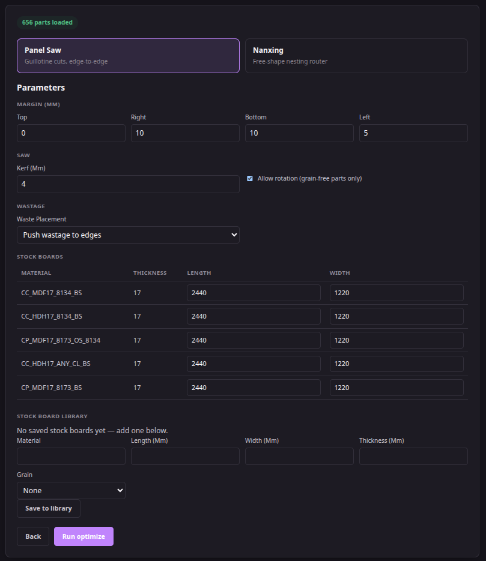
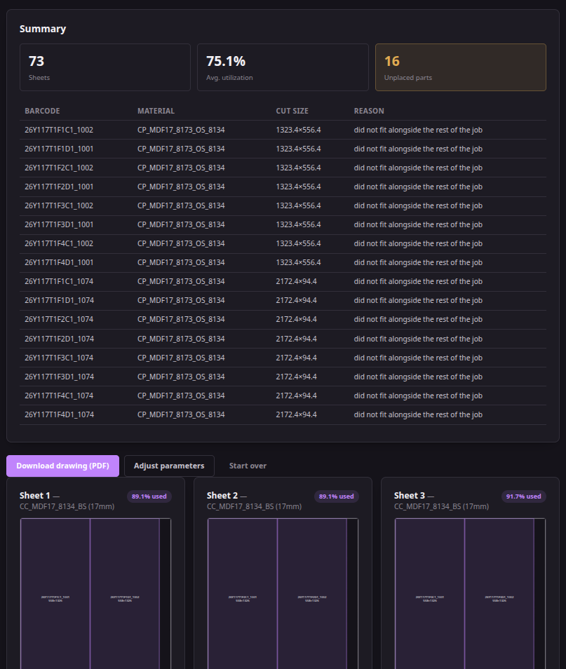

# Issue 001

## Objective

- Why are there unplaced parts?
- Does it mean some parts could not be placed on to the board to cut?
- What can be done to solve this issue?

Note: This is true for both [ Panel Saw ] or [ Nanxing ].

Note: I've used data from [26Y117T1F1B1(BEDROOM%203-4)%20-%2026Y117T1F1B1(BEDROOM%203-4)](../sample_data/CSV%20Files%20from%20IMOS/26Y117T1F1B1(BEDROOM%203-4)%20-%2026Y117T1F1B1(BEDROOM%203-4).csv).