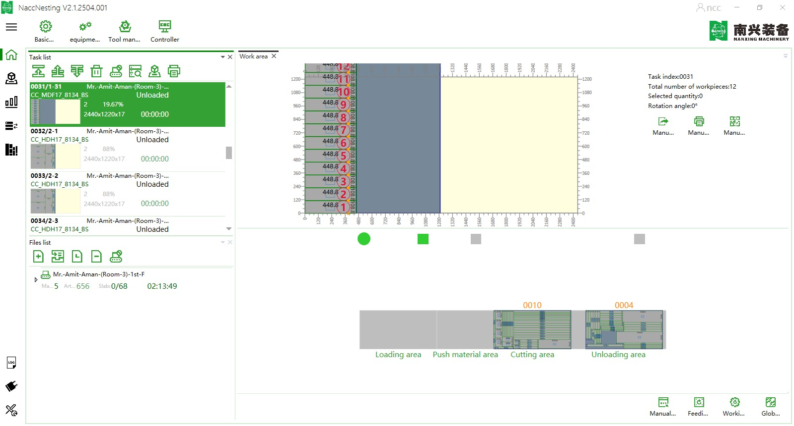
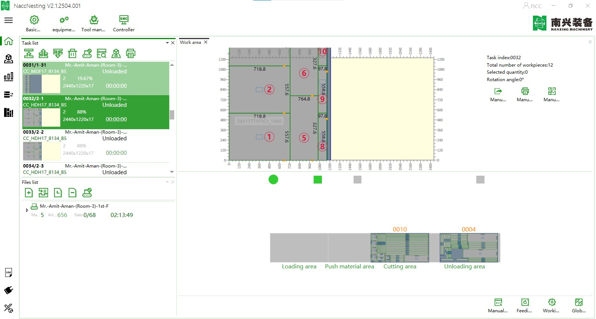
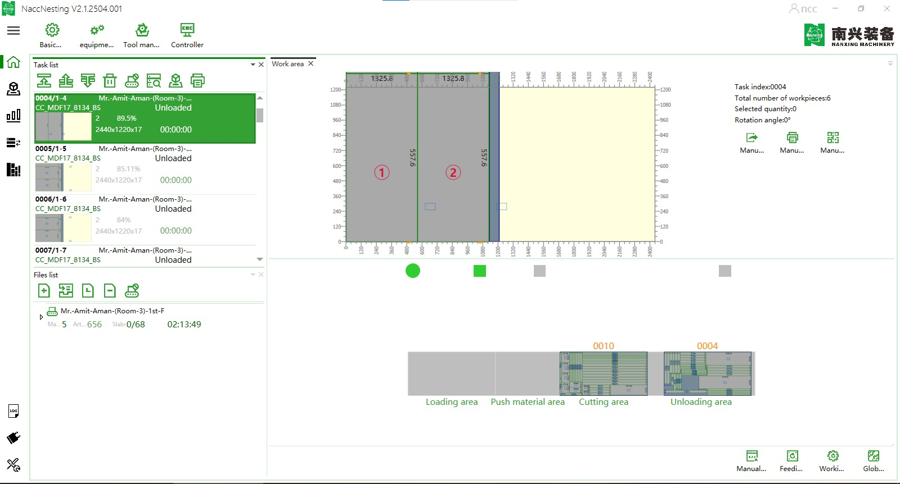
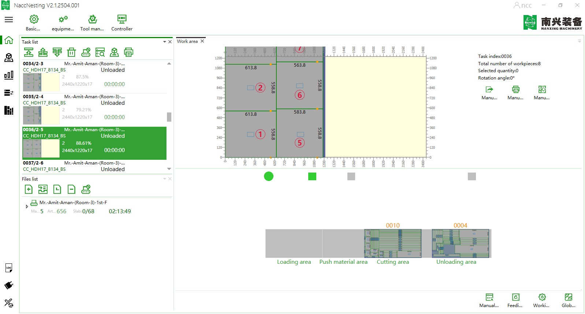

# Issue 002

- The xml file successfully loads in Nanxing Nestig machine. It reads the nesting data.

Issue

The layout detected by the machine is incorrect. The axes is wrong.

Note: I've used data from [26Y117T1F1B1(BEDROOM%203-4)%20-%2026Y117T1F1B1(BEDROOM%203-4)](../sample_data/CSV%20Files%20from%20IMOS/26Y117T1F1B1(BEDROOM%203-4)%20-%2026Y117T1F1B1(BEDROOM%203-4).csv).