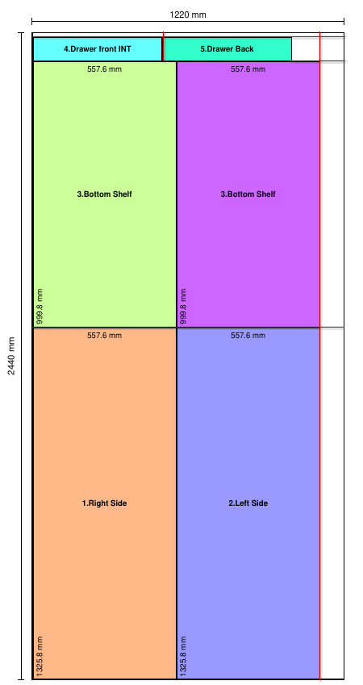

# Issues 004

## Objective

In that layout the red dashed lines run inside the panels (down the right side of the left column, across the top of the right column, etc.), and to a saw operator those look like extra rip cuts on the part itself. Since each panel already has a solid outline defining its finished size, the internal dashed guides add nothing but ambiguity — the operator decides sequencing at the saw.

Fix:

- Keep the cutlines along the part/panel outlines/border. Do not need inside the part/panels.

I want something like this.

>[!note]
>In the image, it is solid line. Just make sure it is dotted like how it is now. I forgot to make it dotted.
