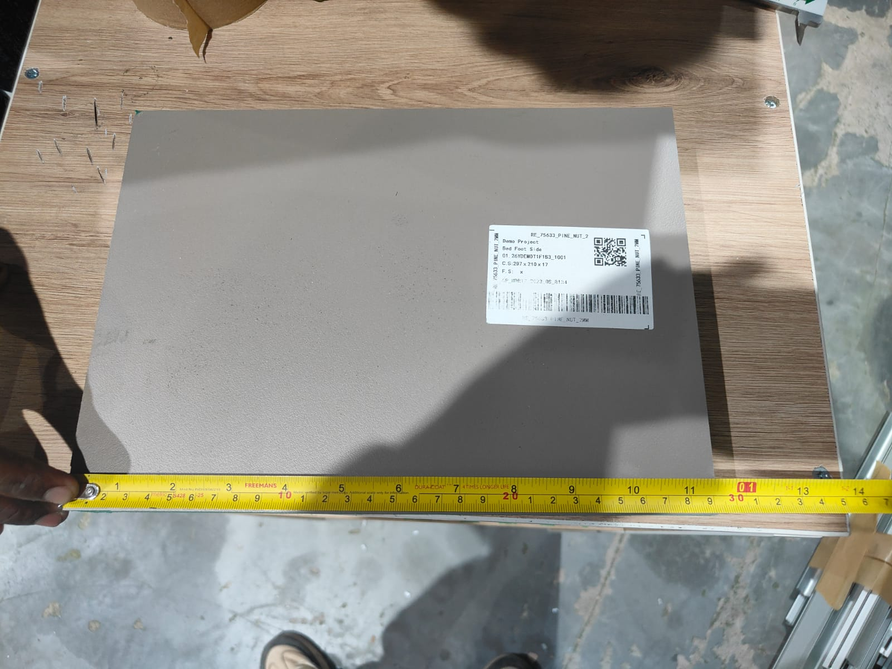
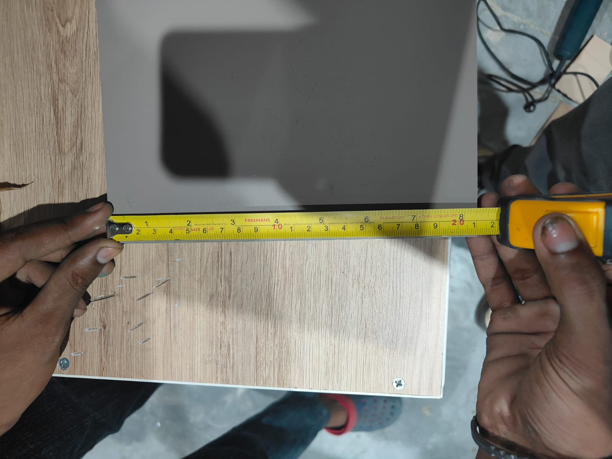
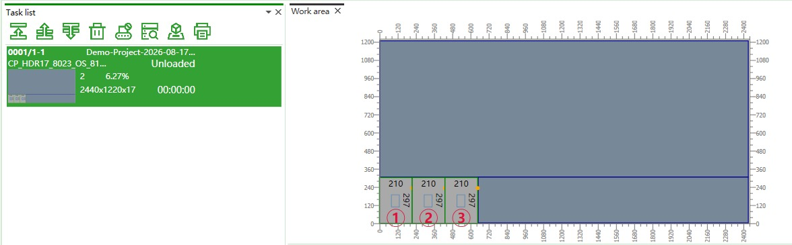
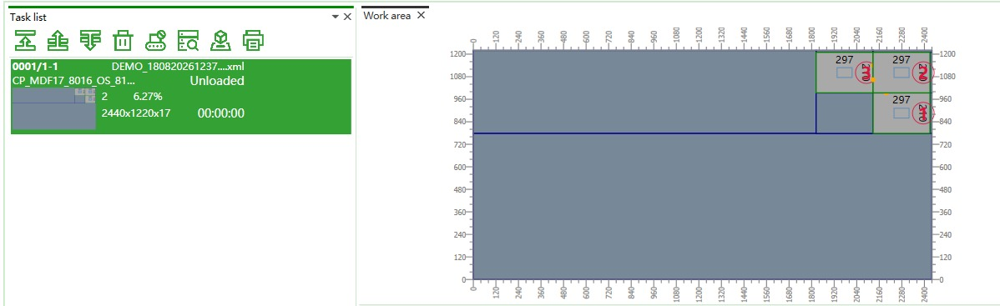

# Issues 005

Good news. Tried cutting operation in Nanxing machine with the optimization file [csv_source_file](../sample_data/CSV%20Files%20from%20IMOS/nesting_machine_data_simple.csv). This is the resultant [optimization xml file](../results/Demo-Project-2026-08-17T13-27-30.xml).

## Issue

- Required width: 297mm
- Actual output on cutting: 290-291 mm

- Required length: 210 mm
- Actual output on cutting: 210 mm

So, along the width there is a discrepency of around 6-7 mm

## Points to consider

May be the following will help.

- Own app(Nesting Pro) optimization file layout in machine: 

- Nanxing machine inbuilt optimization file layout in machine: 

- Nanxing machine inbuilt optimization xml file: [xml file](../results/DEMO_180820261237-nanxing-inbuilt-FccPattern.xml)
