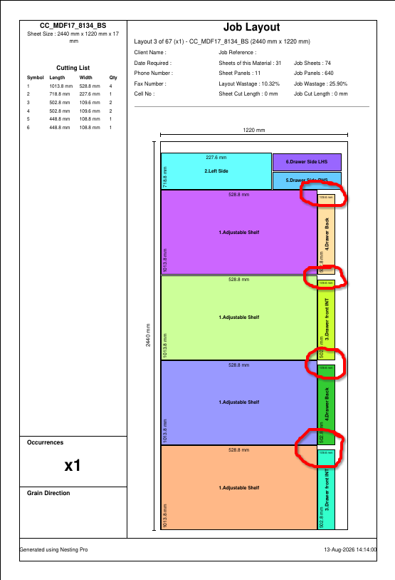

# Update 003

## Objectives

- Maintain separate packers for "Nanxing" nesting router and "Panel Saw" nesting.
- Implement a wastage mechanism with options which tries to
  - push wastage to the edges. instead of in the middle. Look at this  of a optimization drawing layout using nanxing nesting. Optimize for minimum wastage.
